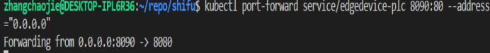

Shifu数据的调用

**一、前期准备**

1.运行docker

2.创建集群 kind create cluster

3.将shifu的配置挂载应用到pod kubectl apply -f k8s/crd/install/shifu_install.yml

**二、Camera的本地测试**

1.Camera配置的路径(可以进行参考)

官网的路径

2.添加镜像camera，导入到kind的节点（容器中）

kind load docker-image edgehub/camera-python:v0.0.1

3.将其挂载应用到pod

kubectl apply -f docs/guide/camera/python/camera-deployment/

4.通过端口转发映射本地端口到指定的应用端口,从而访问集群中的应用程序(Pod)

比如测试端口号为 8089

kubectl port-forward service/edgedevice-camera 8089:80 \--address=\"0.0.0.0\"

5.在浏览器中进行测试

<http://localhost:8089/capture> 代表摄像头采集的单个照片

<http://localhost:8089/stream> 代表摄像头采集的视频(该功能需要前端后续完善)

<http://localhost:8089/info> 代表设备的静态信息照片

[http://localhost:8089/](http://localhost:8089/info)move/up 代表设备的静态信息照片

**三、plc的本地测试**

1.plc配置的路径

2.添加镜像plc，导入到kind的节点（容器中）

kind load docker-image edgehub/plc-device:v0.0.1

3.将其挂载应用到pod

kubectl apply -f docs/guide/plc-device/plc-deployment/

4.通过端口转发映射本地端口到指定的应用端口,从而访问集群中的应用程序(Pod)

比如测试端口号为 8090

kubectl port-forward service/edgedevice-plc 8090:80 \--address=\"0.0.0.0\"

5.先在浏览器中进行测试

<http://localhost:8090/getcontent?rootaddress=M&address=0> 查看参数M的信息

<http://localhost:8090/getcontent?rootaddress=Q&address=0> 查看参数Q的信息

<http://localhost:8090/getcontent?rootaddress=T&address=0> 查看参数T的信息

<http://localhost:8090/getcontent?rootaddress=C&address=0> 查看参数C的信息

**四、 prometheus监控的本地测试**

1.下载prometheus

因为服务器在海外，因此需要加代理

例如本地的ip为http://192.168.138.69

https_proxy=http://192.168.138.69:1080 http_proxy=http://192.168.138.69:1080 helm install prometheus prometheus-community/kube-prometheus-stack \--debug

2.可通过kubectl get pods -w查看进度，若所有的ready都就绪，则说明下载完成

3.通过端口转发映射本地端口到指定的应用端口,从而访问集群中的应用程序(Pod)

比如测试端口号为 9090

kubectl port-forward service/prometheus-kube-prometheus-prometheus 9090:9090 \--address="

0.0.0.0"

4.访问http://localhost:9090即可进入promethus后台

5.可以尝试访问摄像头的内存（&start后面为最新的日期，如果不能访问可以将日期改为最新时间，最新时间为标准北京时间减8）

http://localhost:9090/api/v1/query_range?query=node_namespace_pod_container:container_memory_working_set_bytes{namespace=%22default%22,%20pod=\~%22edgedevice-camera.\*%22,%20image!\~%22.\*pause:.\*%22}&start=2022-05-30T7:00:30.781Z&end=2022-05-30T7:10:00.781Z&step=60s
