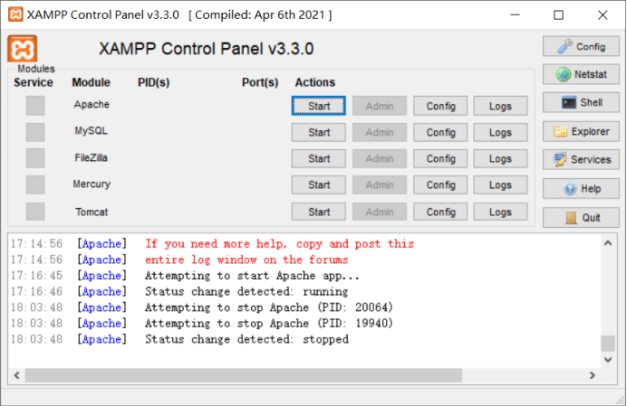
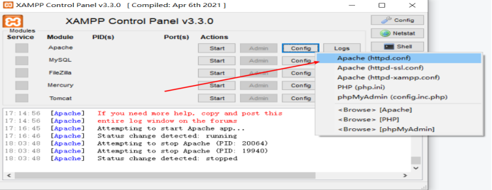
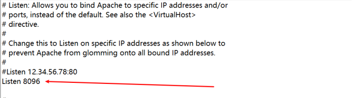
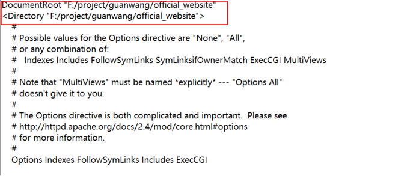

**官网代码调试教程**

1.  Xamapp安装

    安装xamapp

    地址 <https://www.apachefriends.org/zh_cn/download.html>

2.  Apache调试

    

    点击apache下的start，确保有apache

3.  配置项的修改

    修改默认的端口以及文件路径

    点击config\--\>apache(httpd.conf)进入配置

    

    修改listen值为想要调试的本地端口

    

    修改documentroot以及directory 路径为项目文件的路径，路径应为/

    

4.  本地调试

    保存配置项

    点击apache下的start，运行

    输入localhost：端口号

    

    调试成功
